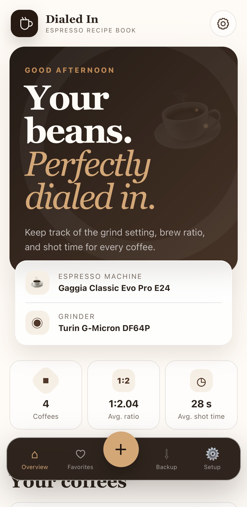
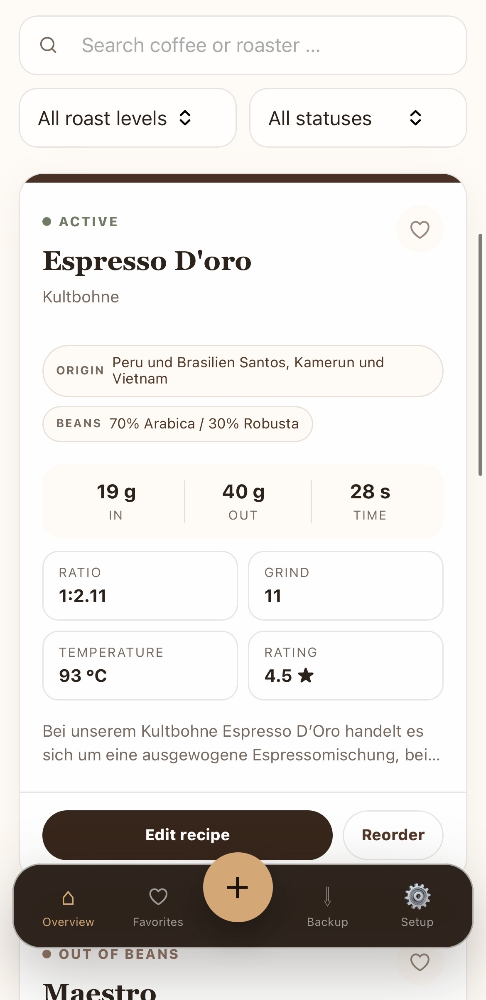
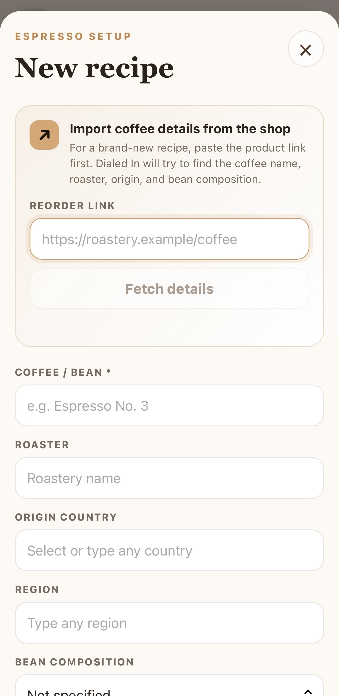

# Dialed In

A mobile web app for your espresso machine and grinder. All data remains inside your home network and is stored centrally in a SQLite database.

<p align="center">
  
</p>

## Features

- Dashboard with coffees, average brew ratio, and average shot time
- Recipes with dose, yield, ratio, shot time, grind setting, and temperature
- Roaster, origin/blend, roast level, status, rating, and notes
- barcode scanner for fetching bean details
- Reorder link for each coffee, scrape website for information when creating a new recipe entry
- Search, filters, and favorites
- Create, edit, and delete recipes
- Central SQLite backend shared by phone, tablet, and desktop
- JSON backup and restore
- Responsive coffee-inspired interface optimized for smartphones


### WebApp Mobile

|  |  | |  |


## Recommended: Automatic Installation on a linux host device (e.g. raspberry pi os)

Extract the ZIP archive or clone git, open the project directory, and run:

```bash
chmod +x install.sh
sudo ./install.sh
```

Then open the app on a device connected to the same network:

```text
http://<IP_ADDRESS>:8080
```

Display the your IP address with:

```bash
hostname -I
```

The service starts automatically after every reboot.

### Manage the Service

```bash
sudo systemctl status dialed-in-coffee
sudo systemctl restart dialed-in-coffee
sudo journalctl -u dialed-in-coffee -f
```

## Alternative: Docker Compose

```bash
docker compose up -d --build
```

Then open:

```text
http://<IP_ADDRESS>:8080
```

The SQLite database is stored at `data/coffee.db`.

## Alternative: Run Manually

```bash
sudo apt update
sudo apt install -y python3 python3-venv
python3 -m venv .venv
source .venv/bin/activate
pip install -r requirements.txt
python server.py
```

On Windows PowerShell:

```powershell
py -m venv .venv
.venv\Scripts\python.exe -m pip install -r requirements.txt
.venv\Scripts\python.exe server.py
```

Open the local app at:

```text
http://localhost:8080
```

## Use a Local Hostname Instead of an IP Address

On many devices, the default hostname works automatically:

```text
http://hostname.local:8080
```

You can change the hostname with:

```bash
sudo raspi-config
```

For example, choose `coffee` as the hostname. The app will then usually be available at:

```text
http://coffee.local:8080
```

## Backup

Use **Setup → Export JSON** to download a complete backup. Importing a backup replaces the recipes currently stored in the database.

You can also back up the database directly:

```bash
cp /opt/dialed-in-coffee/data/coffee.db ~/coffee-backup.db
```

## Security Note

The app intentionally has no login and is intended for use inside your private home network. Do not forward port 8080 directly to the public internet. For remote access, use a private VPN such as Tailscale.

## License
Creative Commons Attribution–NonCommercial 4.0

Full license text:
https://creativecommons.org/licenses/by-nc/4.0/legalcode.txt