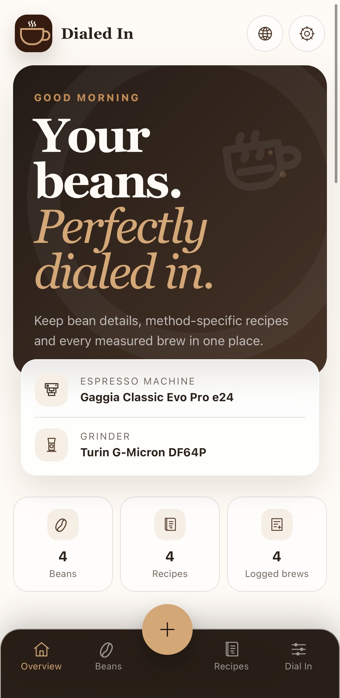
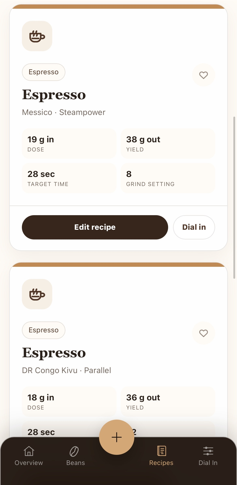
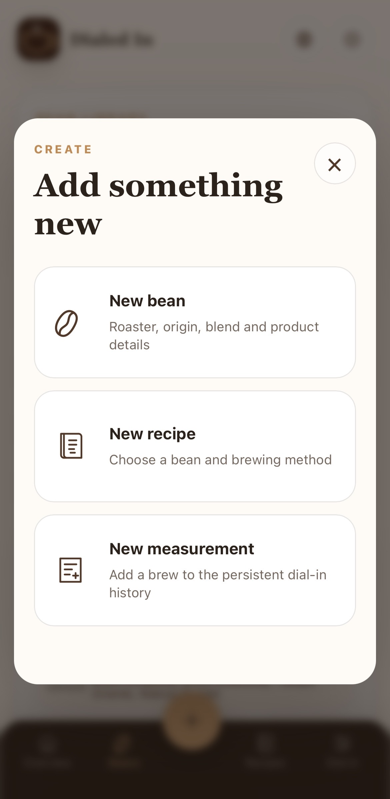
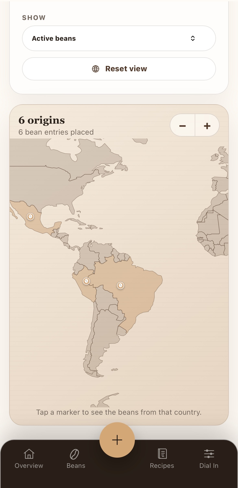

# Dialed In

<p align="center">
  
</p>

Dialed In is a self-hosted coffee companion for keeping track of beans, brewing recipes and dial-in results. It runs in the browser, works across phones, tablets and desktops, and can be hosted on any suitable computer or server.

## Features

### Bean library

- Keep coffee name, roaster, roast level, status, tasting notes and reorder link together
- Store origin country, region or farm separately from the bean composition
- Choose common Arabica and Robusta ratios or enter a custom blend
- Add multiple origins to a coffee and assign blend components to their respective countries
- Mark beans as favorites and filter by roast level, status or availability

### Method-specific recipes

Create independent recipes for every bean instead of limiting a coffee to one set of brewing values. Each method provides suitable fields and, where useful, configurable brewing steps.

Supported methods include:

- Espresso
- Americano
- Flat White
- Cappuccino
- Caffè Latte
- V60
- Pour Over
- Chemex
- AeroPress
- French Press
- Moka Pot
- Cold Brew
- Custom methods

### Dial-in history and recommendations

- Log individual brews with grind setting, dose, yield, time, taste, rating and notes
- Keep separate histories for each bean and recipe
- Exclude unusual or invalid brews from calculations without deleting them
- Calculate a recommended next grind setting from previous measurements
- Limit the maximum suggested adjustment between brews

### Coffee origin map

Explore the origins in your collection on an interactive world map. Beans with several origins appear in each relevant country, and markers can be filtered by bean status.

### Quick bean import

- Scan a barcode to look up available product information
- Paste a roastery or product link to fetch bean details
- Review and correct imported values before saving

### Overview and organization

- Dashboard with current beans, recipes and logged brews
- Choose which brewing method is shown on bean cards
- Search and filter beans and recipes
- Mark both beans and recipes as favorites
- Save your espresso machine and grinder in the app settings

### Backup and restore

Export all beans, recipes, dial-in measurements and settings as a JSON backup. Existing backups from the earlier recipe-only version remain importable.

### Responsive app experience

Dialed In is designed for both desktop and mobile browsers. On supported devices, it can also be added to the home screen for a more app-like experience.

## Screenshots

<p align="center">
  
  
  
  
</p>

## Getting started

Dialed In is not tied to a particular device or operating system. The simplest way to host it is with Docker, but it can also be started directly with Python.

### Docker Compose

From the `coffee-recipe-app` directory, run:

```bash
docker compose up -d --build
```

Then open:

```text
http://localhost:8080
```

When accessing Dialed In from another device, use the address or domain name of the computer hosting it.

To stop the application:

```bash
docker compose down
```

### Run with Python

From the `coffee-recipe-app` directory:

```bash
python -m venv .venv
```

Activate the environment:

```bash
# Linux / macOS
source .venv/bin/activate

# Windows PowerShell
.venv\Scripts\Activate.ps1
```

Install the requirements and start Dialed In:

```bash
pip install -r requirements.txt
python run.py
```

Open `http://localhost:8080` in your browser.

## Backups

Open **Settings** and select **Export JSON** to download a complete backup. Importing a backup replaces the beans, recipes and measurements currently shown in the app, so creating a fresh export beforehand is recommended.

## Privacy and access

Dialed In has no built-in user accounts and is primarily intended for private, self-hosted use. When making it reachable outside a trusted network, place it behind an appropriate authentication and secure connection instead of exposing it directly.

## License

Creative Commons Attribution–NonCommercial 4.0

Full license text:  
https://creativecommons.org/licenses/by-nc/4.0/legalcode.txt
